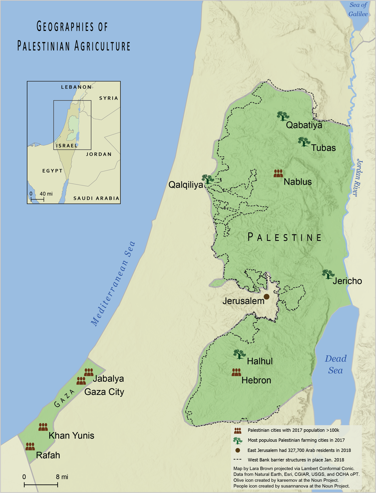
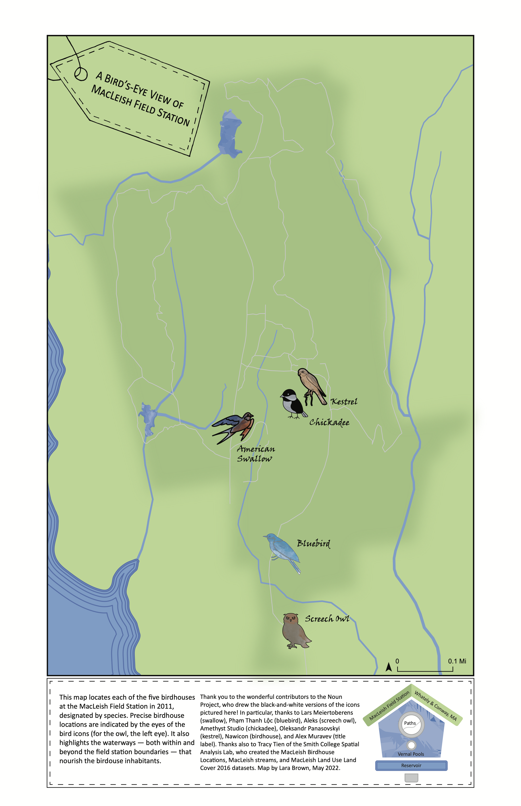
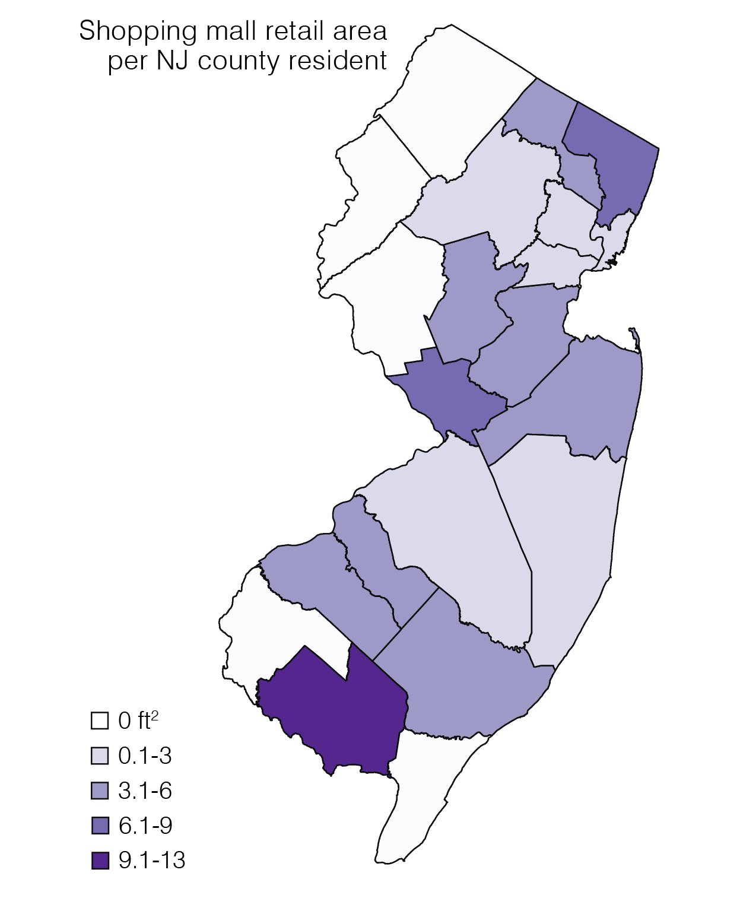

    
# GIS Portfolio Overview

Hello and welcome to my cartography portfolio! Throughout this document, you can find three examples of my work in cartographic design and one example of my spatial animation process.

**Geographies of Palestinian Agriculture** was created in collaboration with an undergraduate environmental justice seminar at Smith College in the spring of 2022. I partnered with a student who was creating a zine to highlight the struggle for land justice and food sovereignty in Palestine. My reference map was intended to be a starting point for her project, providing a broad geographic overview with minimal spatial analysis. I designed this map to more or less comply with a “standard” reference style. In it, I attempt to balance this aesthetic sense of authority with a less standard design choice to center the map on current Palestinian land and cities instead of the present day state of Israel.

  

I created **A Bird’s-Eye View of MacLeish Field Station** as part of an atlas of Smith College’s Ada and Archibald MacLeish Field Station, a wonderful educational and recreational landscape located near the college. With this map, I use playful and visually appealing design elements to locate the five birdhouses on the field station property. I also incorporate narrative cartographic principles into this map by centering the acknowledgements section and drawing attention to all of the near and distant collaborators whose prior work made this piece possible.

  

In my **New Jersey Shopping Malls** thematic map, I calculate and visualize the square footage of shopping malls per capita in each New Jersey county. As a New Jersey resident, I was interested in exploring this somewhat absurd topic due to the complicated history and pervasive presence of shopping malls in the New Jersey cultural psyche. I created this map using data from Wikipedia, and its minimalist style reflects my ultimate goal of uploading it to Wikipedia as well.

  

*In progress: uploading source code used to create the dataset visualized in this map.*

The **Stones of Smith College’s Neilson Library** (https://arcg.is/u4TWj0) is an Esri StoryMap that highlights the building materials used in the construction of the campus library. I developed the original idea for this project and communicated with the library construction team and with quarrying companies to locate all the material source data needed to write this narrative and create maps for the project. Most notably, I generated trucking routes from each stone quarry to Smith College and animated these routes in ArcGIS Pro. These animations can be seen in the StoryMap linked above. My methodology and code for this project is available in a separate [GitHub repository](https://github.com/larabbrown/neilson_materials).
